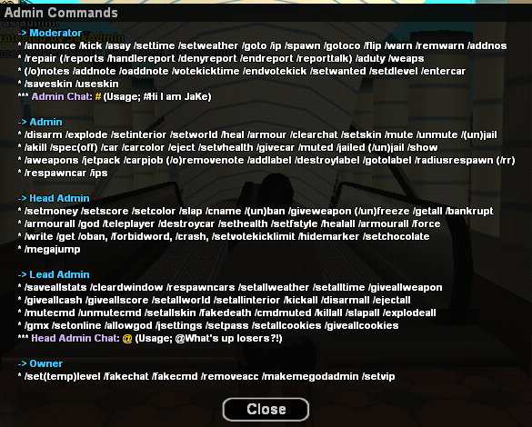
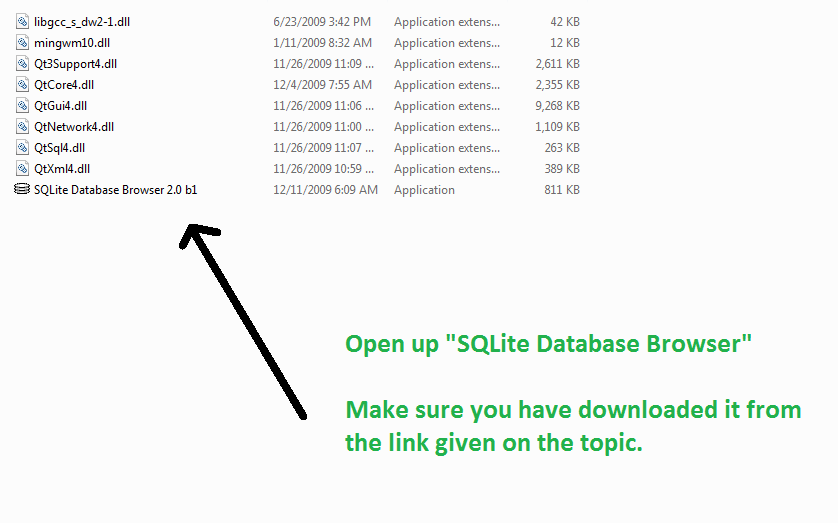
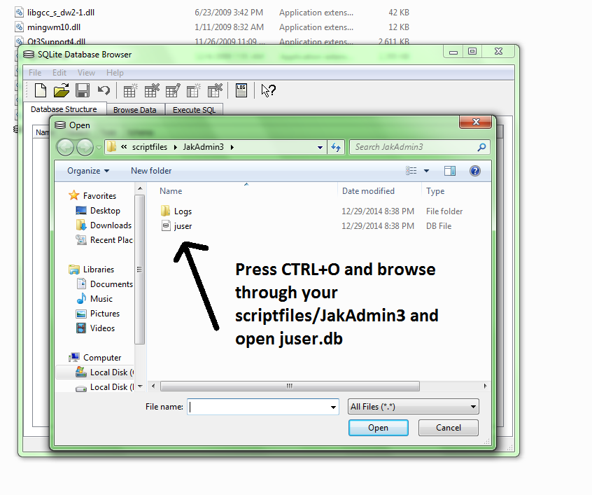
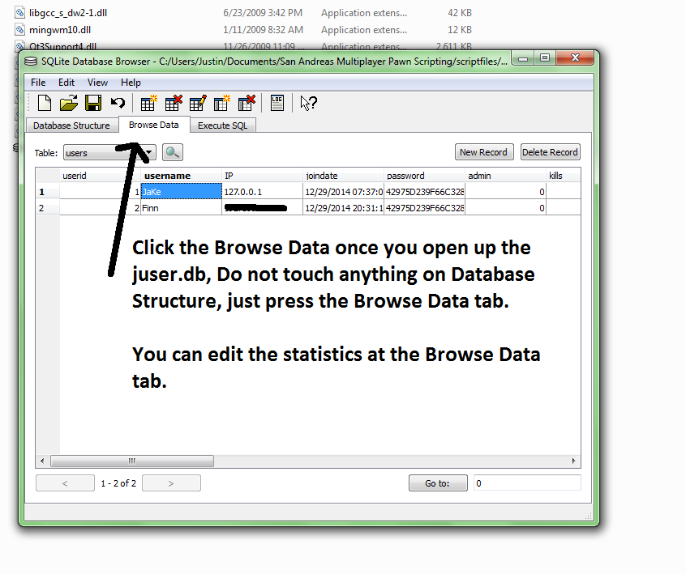
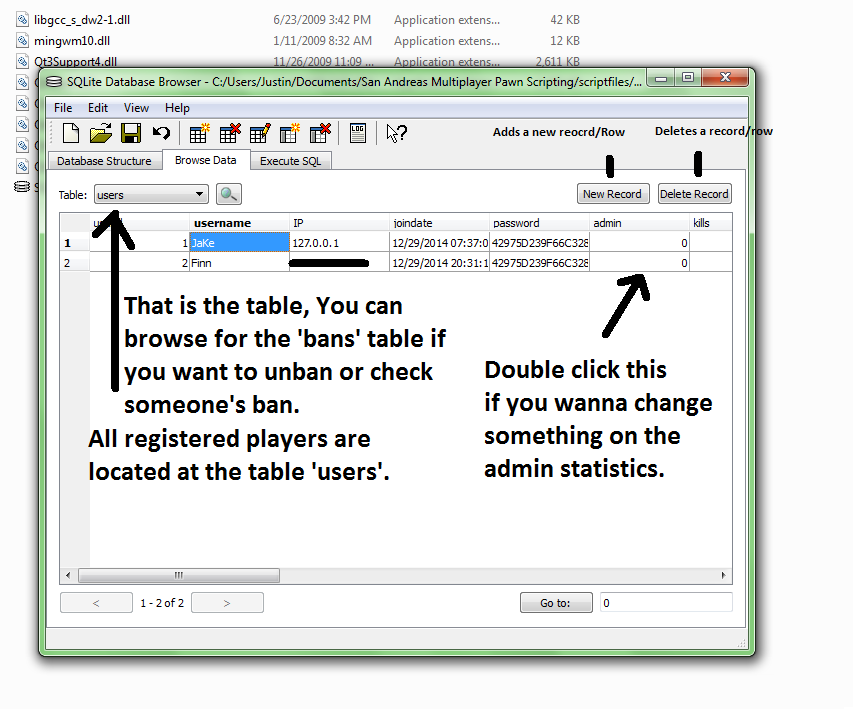
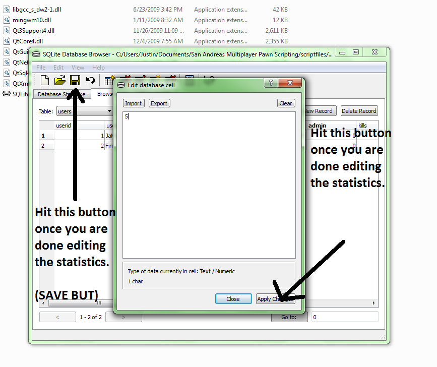
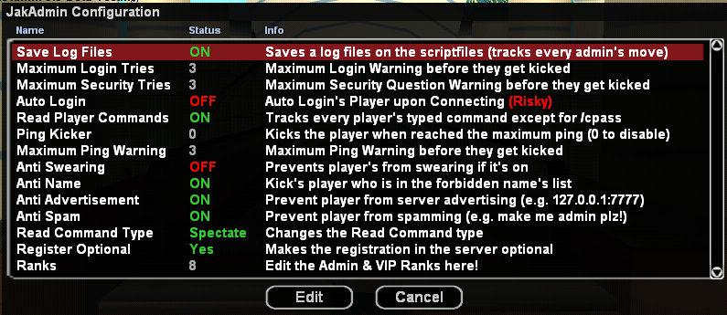

<h1 align="center">JakAdmin3 - User-Friendly/Fast/Efficient (zcmd,sscanf2,foreach,SQLite) (ReMaKe)</h1>

<h3 align="center">* Hello, this administration system made by JaKe Elite is exactly as written, without any modifications, uploaded on 12/31/2017, and currently available in version 3.4 of the archived SA-MP forum. In addition, all the documentation and code is exactly as written by JaKe Elite</h3>

<h3 align="center">JaKe's Admin System 3.5</h3>

<h3 align="center">Last Update: August 21, 2017</h3>

<p align="center">
  <strong>Thank you to Ultraz & denNorske for providing me a temporary host for this Beta-Test, I appreciate it guys! Also thank you to my friends; Milica (Queen), NotDunn, Kizuna, YaBoiJeff (Sean), Pavintharan for participating the Beta-Test</strong>
</p>


## Index
- [Introduction](#introduction)
- [Information/Features](#information--features)
- [Commands](#commands)
- [Note](#note)
- [Installation](#installation)
- [How To Make Yourself Admin?](#how-to-make-yourself-admin)
- [JakAdmin3 Include](#jakadmin3-include)
- [How To Check For Admin Level](#how-to-check-for-admin-level)
- [How To Check For VipLevel](#how-to-check-for-viplevel)
- [How To Check For Admin Level On Your Script](#how-to-check-for-admin-level-on-your-script)
- [How To Check For Vip Level On Your Script](#how-to-check-for-vip-level-on-your-script)
- [Opening .db Files](#opening-db-files)
- [Tracking Player's Last Used IP(s)](#tracking-players-last-used-ips)
- [Leaving Note(s) To Players](#leaving-notes-to-players)
- [Admin Panel](#admin-panel)
- [Configuration](#configuration)
- [Screenshots](#screenshots)
- [Changelog](#changelog)
- [Downloads](#downloads)
- [Credits](#credits)
- [Original](#original)


## Introduction

RomAdmin (now known as JakAdmin3) started off @ September 9, 2012. RomAdmin is the very first version of JakAdmin, the admin system, however, is buggy the project has been shut down @ December 12, 2012. I have made some few attempts on reviving it but I failed. At April 2, 2013 a new version of RomAdmin has been released under the name JakAdmin and since then JakAdmin is born, The admin system itself started off @ dini, from v2.0 reaching to v2.9. There are a lot of features back then such as the Cookie System and JakAdmin Point System, the project has been stopped again @ July 15, 2014. JakAdmin3 project started on October 26, 2014 and the public beta testing was held on December 27, 2014. The original plan was JakAdmin3 will be released on New Years Eve 2015 but my PC got some sort of problem related to its AVR, the release date was moved to January 4, 2015 and since then JakAdmin3 is born (without the project getting shut down after 1 year later..)

This is basically an admin system just like many other else, However, I felt that this one has the best features. The admin system itself is originally based off from LAdmin and LuxAdmin combined but since then I decided to rely on my own ideas instead of copying someone else's work. Don't get confused why the re-issued LAdmin somehow has the same thread format like this, LAdmin's project is now handled by me. Feel free to use the admin system itself, and if you wanted to edit and re-issued your own version of it under your name make sure to send a Private Message.

## Information / Features

- Working at the latest SAMP version.  
- Save Skin Feature *(v3.5)*  
- Vote Kick System *(v3.5)*  
- Track last 10 IPs of players *(v3.5)*  
- Deploy 3D Text Labels *(v3.5)*  
- Note System *(v3.5)*  
- Custom Ban System (with Ban IDs & Ban IP) *(v3.4.1)*  
- SQLite Saving System.  
- UserID system.  
- Option settings for players (Friendly-User).  
- Password hashing (Whirlpool).  
- 103+ administrative/player commands.  
- Report System.  
- VIP System *(v3.4+)*  
- Admin include support (`jadmin3.inc`).  
- Immune System (admins cannot use commands on higher admins).  
- Fully working Anti-Advertisement System (thanks to SickAttack).  
- (New) Admin & VIP ranks editable in-game *(v3.4.1+)*.  
- Safe RCON protection (thanks to Lordzy).  
- Report System with IDs, managed by admins in-game.  
- And much more to discover by yourself.

## Commands

<p align="center">
  <strong>Player Commands (/jcmds)</strong>
</p>

<p align="center">
  <strong>/stats /cpass /register /login /report /admins /jcredits /savestats /vips /cquestion</strong>
</p>

<p align="center">
  <strong>VIP Commands (/vcmds)</strong>
</p>

<p align="center">
    
</p>

<p align="center">
  <strong>Admin Commands (/jacmds)</strong>
</p>

<p align="center">
    
</p>

## Note

For 3.4, An include support+ has been added. If you have VIP system disabled, CheckVip will always return 1 no matter what. Other than that there is no problem, Just to be sure if you found any problems on the include support+ just post it down and I will check it out later.

If you've experienced some odd technical errors, Please file in a bug report at this thread or better yet PM me.

## Installation

1. Open the JakAdmin rar file
2. Extract the 4 folders, filterscripts/pawno/plugins and scriptfiles to your server files.
3. Open server.cfg from your server files.
4. To load JakAdmin, in the line filterscripts, add "jadmin3" (Without quote) so it will be look like this for example.
filterscripts jadmin3 td
5. Now after loading the filterscript, we're not done yet, Go to the line plugins (if there's no line plugins add one)
6. Add these on the server.cfg (plugins line)

`Windows Users`: sscanf whirlpool libRegEx  
`Linux32 Users`: sscanf.so whirlpool.so libRegEx.so (libRegEx.so can be found inside JakAdmin.rar./plugins/linux32)  
`Linux Static Users`: sscanf.so whirlpool.so libRegEx_static.so (libgRegEx_static.so can be found inside JakAdmin.rar/plugins/linuxstatic)  

`For Windows Users` - Extract onig.dll next to samp-server.exe (outside the plugins folder, onig.dll can be found right after you open the JakAdmin rar)  

`For Linux32 Users` - Extract libgonig.so.2 outside the plugins folder, The file can be found at JakAdmin/plugins/linux32  

---

If the plugins and includes that are used in JakAdmin3 is outdated, update them and recompile JakAdmin and the other scripts!

## How To Make Yourself Admin?

1. Connect to your server with the jadmin3.amx (JakAdmin3) loaded into your server.
2. Login to your RCON (/rcon login [your rcon password])
   (( If the 2nd Protection of JakAdmin3 is enabled ))
3. Type the 2nd RCON password (If you haven't edited the script yet the password is changeme)
4. Type /makemegodadmin and you are done.
   (( If the 2nd Protection of JakAdmin3 is disabled ))
5. Type /makemegodadmin and you are done.

## JakAdmin3 Include

```pawn
native SetPlayerGameTime(playerid, hour, minute, second);
native GetPlayerGameTime(playerid, &hour, &minute, &second);
native SetPlayerChocolate(playerid, amount);
native GetPlayerChocolate(playerid);
native vipcheck(playerid);
native CheckLogin(playerid);
native SetPlayerLogged(playerid, toggle);
native CheckVip(playerid);
native SetPlayerVip(playerid, level);
native SavePlayer(playerid);
native CheckAdmin(playerid);
native SetPlayerAdmin(playerid, level);
native CheckPlayerMute(playerid);
native CheckPlayerMuteSecond(playerid);
native CheckPlayerCMute(playerid);
native CheckPlayerCMuteSecond(playerid);
native SetPlayerMute(playerid, toggle);
native SetPlayerMuteSecond(playerid, seconds);
native SetPlayerCMuteSecond(playerid, seconds);
native CheckPlayerJail(playerid);
native CheckPlayerJailSecond(playerid);
native SetPlayerJail(playerid, toggle);
native SetPlayerJailSecond(playerid, seconds);
native CheckAccountID(playerid);
native CheckPlayerWarn(playerid);
native SetPlayerWarn(playerid, warn);
native CheckPlayerKills(playerid);
native SetPlayerKill(playerid, kill);
native CheckPlayerDeaths(playerid);
native SetPlayerDeath(playerid, death);
```

## How To Check For Admin Level

```pawn
CMD:mycommand(playerid, params[])
{
    LoginCheck(playerid); //Always add this.
    LevelCheck(playerid, 1); //Level 1 admin, Change 1 to anything you want (1 to 5).
    
    //Place your script code here.
    return 1;
}
```

## How To Check For VipLevel

_Note; Make sure the VIP system is enabled._

```pawn
CMD:mycommand(playerid, params[])
{
    LoginCheck(playerid); //Always add this.
    VipCheck(playerid, 1); //Level 1 vip, Change 1 to anything you want (1 to 3).
    
    //Place your script code here.
    return 1;
}
```

## How To Check For Admin Level On Your Script

```pawn
#include <jadmin3> //below all of your includes
CMD:yourcmd(playerid, params[])
{
    if(CheckAdmin(playerid) >= 1)
    {
        //
    }
    else
    {
        //
    }
    return 1;
}
```

## How To Check For Vip Level On Your Script

_Note; Make sure the VIP system is enabled._

```pawn
#include <jadmin3> //below all of your includes
CMD:yourcmd(playerid, params[])
{
    if(CheckVip(playerid) >= 1)
    {
        //
    }
    else
    {
        //
    }
    return 1;
}
```

## Opening .db Files

JakAdmin3 uses .db files (SQLite default format for saving), they can't be opened with Notepad or Wordpad. You need a special program to open it, for example the SQLite Browser. I used it on opening the .db files, It can be downloaded by clicking this link [SQLite Browser](https://sqlitebrowser.org/)

Now after you downloaded it, Follow the instructions on the picture:

<p align="center">
    
</p>

<p align="center">
    
</p>

<p align="center">
    
</p>

<p align="center">
    
</p>

<p align="center">
    
</p>

## Tracking Player's Last Used IP(s)

Have you ever always wanted to track down someone who is trying to connect to your account or to someone's account? Do you want to track down a multi-accounter or a possible user who is using VPN? You may now track down all of the used IPs of that player (however only 10 IPs can be listed in game with the command /ips).

_`Note`_: If you have the same IP and it's already written/registered in the database, The script will delete the old one and write a new one with the new registered date & time.

<p align="center">
    
</p>

## Leaving Note(s) To Players

You may leave a note to a player for other administrator(s) to see.                                                                                                                          
_`Example Scenarios`_: Player is possibly hacking, a multi-accounter and you wanted to let the other admins know.

You can issue the note to offline players or view them even the player is offline. (/onote and /onotes)

<p align="center">
    
</p>

<p align="center">
    
</p>

## Admin Panel

For administrators level one+, Double click on the player's name in player-tab in order to open the admin-panel dialog.

<p align="center">
    
</p>

## Configuration

config.ini has returned since the very last version of JakAdmin (which is v2.9) - You can now edit the stuffs that is found from earlier version of JakAdmin3 in-game with ease! **You can now also edit the admin ranks and VIP ranks through /jsettings!**

<p align="center">
    
</p>

## Screenshots

<p align="center">
    
</p>

<p align="center">
    
</p>

## Changelog

### Version 3.5
- Vote Kick System added.  
- `/jsettings` moved to level 4 admins.  
- Few script optimizations (lowering the string usage).  
- Brought back the Save-Skin feature.  
- `/specoff` and `/spec` have been combined together.  
- Added Head Admin Chat for Level 4+ admins.  
- Added Temporary-Level Promotion System.  
- Added Log Checks on Report (for Owners+).  
- Ability to enter vehicles (`/entercar`).  
- Tracks all the IPs that the player has used (`/ips [account name]`).  
- Admins can change an account's password (level 4 admins).  
- Ability to give players mega-jump (`/megajump`).  
- Adjustments on `/explode` and `/explodeall`.  
- `/respawncar` has been added.  
- `/radiusrespawn` has been added (shortcut `/rr`) – respawn cars within radius.  
- Level 4+ admins can now give players `/god` (`/allowgod`).  
- Ability to manipulate/control player's wanted level (`/setwanted`).  
- Ability to manipulate/control player's drunk level (`/setdlevel`).  
- Level 3+ admins can now hide their markers.  
- Patched OPRL include to its latest version.  
- Removal of RegEx for detecting server advertisement.  
- Player's current online time (not TOTAL time) is now counted.  
- Level 4+ admins can manipulate player's total playing time.  
- Added a Chocolate Bar system (controlled through `jadmin3.inc`).  
- Revised Read Commands (switch modes from "Global" to "Spectating Player").  
- Ability to deploy 3D Text Labels (`#MAX_DEPLOYABLE_LABEL` – default 30).  
- New Note System (leave notes to a specific player for other admins to read).  
- No longer need a parameter on `/stats` to view your own stats.  
- Players can skip registration and register later (toggleable via `/jsettings`).  
- Scores & cash now save correctly (bug fix).  
- TAB: Quick Easy Admin Access by clicking on player's name (+ players can report by clicking on names).  

### Version 3.4.2
- Adjusted the codes on loading the player's ban.  
- Adjusted the codes on loading the player's statistics.  
- Replaced old comments in the script with more detailed ones.  
- Removed a timer syncing player's score and money to JakAdmin3.  
- Re-adjusted the God System to the Ping Kick timer.  
- Re-worked the Report System.  
- Admins are now invincible when on duty (no damage from players).  

### Version 3.4.1 (4th Anniversary!)
- IMPORTANT: Fixed VIP System; VIP level now saves.  
- Re-worked how JakAdmin3 creates tables & database. Along with the messy way of how JakAdmin3 inserts a new player data!  
- Added VIP level on `/stats` (thanks Twiix).  
- `/vips` command added (thanks again Twiix).  
- Improved Vehicle Spawn code.  
- Re-touched the script.  
- `/cpass` is now invisible from Read Commands.  
- Return of `config.ini`. Welcome back dini!  
- Removed "JakAdmin3" from register & login dialog.  
- After reaching the maximum warning on Security Question, you will get kicked!  
- `/stats` completely redesigned.  
- Player's can now change their Security Question and Security Answer. (They have to input their passwords first)  
- Re-introduced the old Anti-Swear & Anti-Name system of JakAdmin (based on LAdmin, thanks LethaL!).  
- Minor fix on `/vcmds`.  
- Re-introduced admin ranks (saved with `config.ini`, editable IG `/jsettings`).  
- Re-introduced `/admins` and `/vips` dialogs.  
- Admin Chat moved back to old style (`#hey guys!`), same for VIP Chat.  
- Kick Delay decreased from `2000ms` to `800ms`.  
- Added BanID on ban table (improved ban system, banning IP as well).  
- Added `/crash` command (same as LAdmin5's `/crash`).  
- Removed `GetPlayerColor` from `/ip`.  
- `/cname` now renames the player's account.  
- Typing `none` on `/cquestion` disables Security Q&A. (The word none is disabled though on the main setup of Securtiy Question&Answer)  
- New anti-advertisement system (thanks SickAttack).  

## Downloads

Download links below. Click to be directed to the file.

| Version | Release Date | Link  | Upload Site | SA-MP Version | Status   |
|---------|--------------|-------|-------------|---------------|----------|
| 4.0     | 01/01/18     | [Click](https://github.com/Straydet/JakAdmin4/releases/tag/4.0) | Github  | 0.3.7         | _**Active**_/Latest |
| 3.5     | 08/21/17     | Not Working | ZippyShare  | 0.3.7         | Missing/Outdated |
| 3.4.2   | 01/26/17     | Not Working | ZippyShare  | 0.3.7         | Missing/Outdated |
| 3.4.1   | 09/09/16     | Not Working | ZippyShare  | 0.3.7         | Missing/Outdated |
| 3.4     | 02/07/16     | [Click](https://github.com/Straydet/JakAdmin3/releases/tag/3.4)   | Github  | 0.3.7         | _**Active**_/Outdated |
| 3.3.1   | 01/11/16     | Not Working | Solidfiles  | 0.3z          | Unavailable/Outdated |

## Credits

_Jake_, Y_Less, DracoBlue, Zeex, Zher0, Lordzy, SickAttack, Koala818, Twiix
Milica, NotDunn, Kizuna, YaBoiJeff (Sean), Pavintharan, denNorske
Ranveer, Harvey, Ultraz Samp_India, Ashirwad, Sonic, Adham, MaxFranky and others who helped us.

You may use this script on your server, You have to ask permission though if you are gonna redistribute this (Doing some modifications and editing it.)

## Original

- [[FilterScript] JakAdmin3 - User-Friendly/Fast/Efficient (zcmd,sscanf2,foreach,SQLite) (ReMaKe) - SA-MP Forum Archive](https://sampforum.blast.hk/showthread.php?tid=554546)
